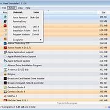

## windows电脑好用的软件
### 1.erevything
- 一款好用的搜索windows电脑搜索软件
- 厌倦了windows的原版搜索？来试试这个，0.1秒出结果

[erevythink官网](https://www.voidtools.com/zh-cn/downloads/)

### 2.bandizip
- 一款支持全压缩包后缀的解压软件
- 免费，不过在最新版的bandizip，官方加入了一些广告

[bandizip官网](https://www.bandisoft.com/bandizip/)

### 3.geek卸载工具
- 你是不是卸载不干净软件？试试这个，注册表都能给你卸载干净！！！

[geek官网](https://geekuninstaller.com/)
